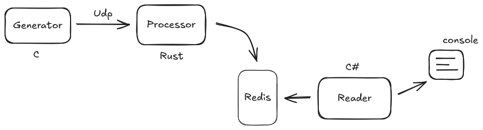

## Projeto Rust + C + Dotnet

Projeto simples de estudo para integrar Rust, C e C#. 

### Functionamento
- Generator: Envia dados de timestamp
- Processor: Recebe os dados e escreve num Redis
- Reader: Lê do Redis e apresenta via console

### Esquema
